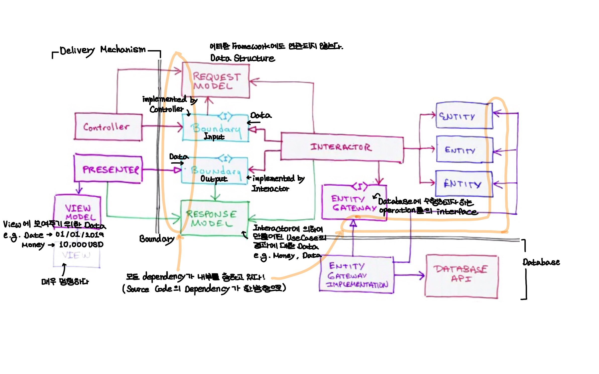

# Clean Architecture

- [특징](#특징)
- [Layer](#Layer)
  - [Dependency Rule](#Dependency-Rule)
  - [Entity](#Entity)
  - [UseCase](#UseCase)
  - [Interface Adapter](#Interface-Adapter)
  - [Framework and Driver](#Framework-and-Driver)

### "Architecture is about intent" 

> "아키텍쳐는 의도를 표현하는 것입니다."

- 최상위 디렉토리 구조를 통하여 "Application이 무엇을 하는 가"를 알 수 있어야합니다.

- 제대로 된 Architecture는 Application이 무엇을 위한 것이고, 무엇을 하는 것이지 알 수 있어야합니다.

  > ~~"이것은 iOS Application이다"~~를 뜻하는 것이 아닌, 
  >
  > "이것은 Todo list를 위한 Application이며, Todo에 대한 CRUD를 할 수 있다."를 알아야합니다.

  e.g. 청사진을 보고, "이것은 도서관이다" 혹은 "이것은 교회이다."를 알 수 있습니다.

- 상속은 매우 강한 관계입니다. Interface를 이용하여 수평확장을 합니다.

### 특징

- 프레임워크 독립적
- 테스트 용이함
  - 비지니스 규칙은 UI, 데이터베이스, 서버 등 기타 외부 요인 없이 테스트 가능합니다.
- UI 독립적
  - 시스템의 나머지 부분을 변경할 필요 없이 UI를 쉽게 변경할 수 있습니다.
- 데이터베이스 독립적
  - 어떠한 데이터베이스로도 바꿀 수 있습니다.
  - 비지니스 규칙은 데이터베이스에 얽매이지 않습니다.
- 외부 기능 독립적
  - 비지니스 규칙은 외부 세계에 대하여 아무것도 모릅니다.

## Layer

### Dependency Rule

- 바깥 영역으로 갈수록 HighLevel Software가 됩니다.
  - 바깥 영역은 Mechanism이고, 내부 영역은 Policy입니다.
- **Dependency는 오직 내부**로만 향합니다.
  - 내부의 영역은 바깥 영역의 어떠한 것도 알아서는 안됩니다.
  - 바깥 영역의 어떠한 것도 내부 영역에 영향을 주어서는 안됩니다.
- 내부 계층으로 향할수록 추상화의 수준이 상승합니다.
  - 내부로 이동해가면서 소프트웨어는 추상화되고 구수준의 정책을 캡슐화 합니다.

### Entity

- Enterprise Business Rule을 캡슐화합니다.
  - 규칙이자 정책이며 Application이 없어도 존재할 수 있습니다.
  - **Application에 비종속적인 Business Rule**들입니다.
  - 단지 하나의 Application을 작성할 뿐이라면, 해당 Application의 Business Object가 됩니다.

> Business Rule
>
> - 많은 어플리케이션에 적용이 되어야하는 글로벌 비지니스 규칙 (Entity)
> - 특정 어플리케이션에만 적용되는 비지니스 규칙 (UseCase)

- 가장 일반적이면서 고수준의 규칙을 캡슐화합니다.
- Business Object는 오염되지 않아야합니다.
  - 바깥 영역의 것이 변경되더라도 바뀌지 않습니다.

### UseCase

- **Application의 의도는 Use Case를 통하여 드러나게 됩니다**.
  - 따라서, **Application의 Architecture는 Use Case**들입니다. 
- UseCase 계층은 **Application Specific Business Rule**을 포함하며 시스템의 모든 UseCase를 캡슐화하고 구현합니다.
  - Application 없이 존재할 수 없습니다.
- UseCase들은 Entity로 향하는 혹은 Entity로 부터 나오는 데이터 흐름을 조정합니다.
- UseCase 계층의 변경이 보다 내부의 영역인 Entity에 영향을 주지 않아야 하며, 보다 외부의 영역인 Database, UI, Framework의 변경으로부터 영향을 받지 않아야합니다.
- UseCase는 `Interactor`라는 Object로 Object화할 수 있습니다.
  - 즉, UseCase와 Interactor는 동일한 것입니다.

### Interface Adapter

- Interface Adapter 계층의 소프트웨어는 UseCase와 Entity에서 사용하기 편한 형식을 외부의 것(e.g. Database, web etc)에서 사용하기 편한 형식으로 변환해주는 adapter의 집합입니다. 

### Framework and Driver

- 가장 바깥 계층으로, Database나 Web Framework 등과 같은 툴들 과 프레임워크들로 구성되어져 있습니다.

- UI, Database, Framework 등은 Detail입니다.
  - Database는 저장소일 뿐, Business Rule과는 관련이 없습니다. 

    > The database is a detail

### Reference

- [The Clean Architecture - Uncle Bob](https://blog.cleancoder.com/uncle-bob/2012/08/13/the-clean-architecture.html)
- [The Clean Architecture - Uncle Bob (한글 번역)](https://blog.coderifleman.com/2017/12/18/the-clean-architecture/?utm_medium=social&utm_source=gaerae.com&utm_campaign=개발자스럽다)
- [Robert C. Martin - Clean Architecture and Design (2014)](https://amara.org/ko/videos/0AtjY87egE3m/url/1216370/?tab=video)
- [The Principles of Clean Architecture by Uncle Bob Martin](https://www.youtube.com/watch?v=o_TH-Y78tt4&t=1113s)

- [안드로이드에 Clean Architecture 적용하기](https://academy.realm.io/kr/posts/clean-architecture-in-android/)
- [아키텍처와 의존성](https://blog.appkr.dev/learn-n-think/clean-architecture-and-dependency/)
- [Introducing Clean Architecture](https://www.slideshare.net/rocboronat/introducing-clean-architecture-61200981?from_action=save)
- [Architecting Android...The clean way?](https://fernandocejas.com/2014/09/03/architecting-android-the-clean-way/)
