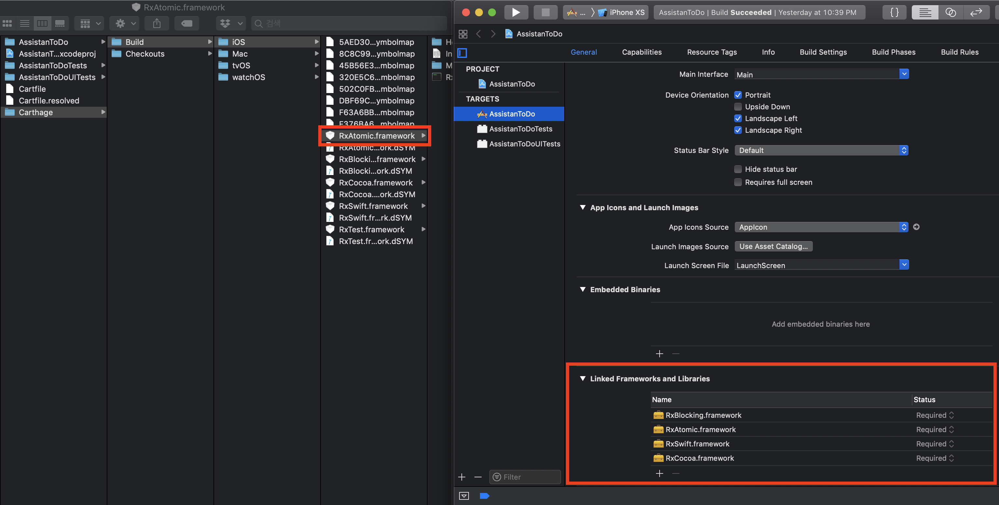

# Carthage

## Overview

Carthage란 무엇인가, Cocoapod과의 차이, Carthage를 적용하는 방법에 대하여 기술하였습니다.

## Table of Contents

- [Dependency Manager](#Dependency-Manager)
- [Cocoapods](#Cocoapods)
- [Carthage](#Carthage)
- [Apply Carthage(feat. RxSwift)](#Apply-Carthage(feat.-RxSwift))
- [.gitignore](#.gitignore)
- [Refrence](#Reference)

# Dependency Manager

https://stackoverflow.com/questions/27285783/package-manager-vs-dependency-manager 을 참고한다면, 

**Dependency Manager**는 하나의 프로젝트에 국한된 것으로, 다른 프로젝트에서 사용을 위해서는 다시 설정을 해줘야합니다.

**Package Manager**는 시스템을 설정하는 것으로, 개발 환경을 설정해 놓으며 많은 프로젝트에 대하여 적용이 가능합니다.

위 Manager들은

- Third Party를 가져와서 프로젝트에 통합하는 처리를 단순화, 표준화 합니다. 

  > 사용하지 않는다면, 모든 동작을 수동으로 처리해야합니다.

- 나중에 Third Party 라이브러리를 쉽게 업데이트 할수 있습니다. 

  > 사용하지 않는다면, 라이브러리가 업데이트될 때마다 하나씩 수동으로 업데이트해야합니다.

- 만약 Third Party 내에서 의존성이 존재할 경우, 적절히 호환 가능한 버전을 골라냅니다.

  > 사용하지 않는다면, 각 라이브러리마다 호환성을 따지며 추가해줘야합니다.


# CocoaPods

https://github.com/CocoaPods/CocoaPods

- 설치와 사용이 쉽습니다.
- `pods` 를 사용하기 위해서는 `.xcworkspace` 파일을 생성하고, 사용해야합니다. 
- podspecs repositories는 중앙집중적이여서, 사라지거나 접근할 수 없을 때 문제가 발생할 수 있습니다.
- 대부분의 라이브러리들이 지원을 하고 있습니다.

# Carthage

https://github.com/Carthage/Carthage

- 초반 설정에 조금의 귀찮은 작업이 존재합니다.
- workspace 사용에 대하여 강제성이 없습니다.
- 반중앙집중적이며, Xcode Project에 의존성이 있습니다.
- Carthage를 지원하지않는 라이브러리가 종종 존재합니다. :'(

## Apply Carthage(feat. RxSwift)

#### 1. [Installing Carthage](https://github.com/Carthage/Carthage#installing-carthage)

Carthage를 설치하는 여러 방법이 존재합니다. 이 게시물은 **Homebrew**를 이용한 설치에 대한 내용입니다.

Terminal에서 아래와 같은 코드를 넣으면 carthage의 설치가 끝납니다.

```
$ brew update
$ brew install carthage
```

하지만, 저의 경우 아래와 같은 에러가 나왔습니다.

```
An unexpected error occurred during the `brew link` step
The formula built, but is not symlinked into /usr/local
Permission denied @ dir_s_mkdir - /usr/local/share/fish/vendor_completions.d
Error: Permission denied @ dir_s_mkdir - /usr/local/share/fish/vendor_completions.d
```

위 에러에 대한 해결방법입니다. (참고 : https://stackoverflow.com/questions/47513024/how-to-fix-permissions-on-home-brew-on-macos-high-sierra)

```
$ sudo mkdir /usr/local/Frameworks
$ sudo chown $(whoami):admin /usr/local/Frameworks    
$ brew link carthage
```

#### 2. [Adding frameworks to an application fo iOS, tvOS, or watchOS](https://github.com/Carthage/Carthage#if-youre-building-for-ios-tvos-or-watchos)

1. Cartfile 생성

   적용하고자 하는 프로젝트의 root로 이동한 후, Cartfile을 생성해줍니다.

   ```
   $ touch Cartfile
   ```

2. Cartfile 수정

   Cartfile을 Xcode에서 열어줍니다.

   ```
   $ open -a Xcode Cartfile
   ```

   사용하고자 하는 Carthage를 Cartfile에 추가합니다.

   ```
   //Cartfile
   github "ReactiveX/RxSwift" ~> 4.0
   ```

3. `carthage update` 를 실행하면, 종속성을 가져 와서 각 폴더를 작성하거나 사전 컴파일된 프레임 워크를 다운로드합니다. `carthage update --platform ios` 를 이용하여 iOS만 빌드할 수 있습니다.

4. Carthage/Build 폴더에서 framework를 "Linked Frameworks and Libraries"에 추가해줍니다. 
   

5. **Run Script Phase** 를 수정합니다.

   ```
   /usr/local/bin/carthage copy-frameworks
   
   $(SRCROOT)/Carthage/Build/iOS/<FRAMEWORK NAME>.framework
   ```

   

6. **Unit test or a framework**

   

   

## .gitignore

```
# Created by https://www.gitignore.io/api/xcode,carthage,cocoapods,swiftpackagemanager
# Edit at https://www.gitignore.io/?templates=xcode,carthage,cocoapods,swiftpackagemanager

### Carthage ###
# Carthage
#
# Add this line if you want to avoid checking in source code from Carthage dependencies.
# Carthage/Checkouts

Carthage/Build
Carthage/Checkouts/
```

## Reference

- https://medium.com/xcblog/swift-dependency-management-for-ios-3bcfc4771ec0

- https://www.raywenderlich.com/416-carthage-tutorial-getting-started
- https://www.mokacoding.com/blog/setting-up-testing-libraries-with-carthage-xcode7/