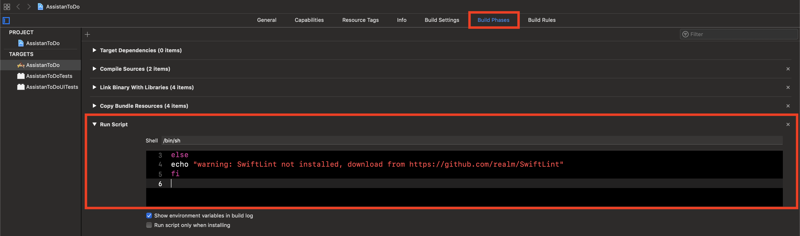
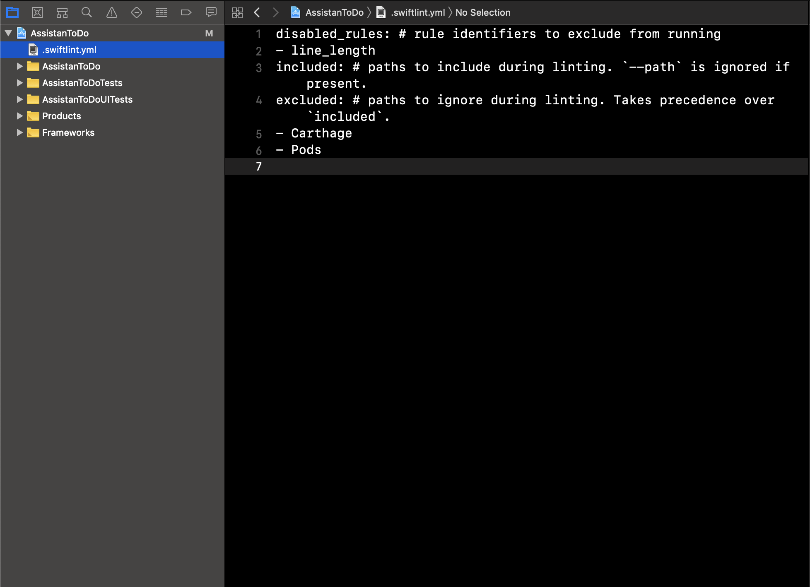

# Swift Lint

## Overview

Swiftlint는 [Github Swift Style Guide](https://github.com/github/swift-style-guide)를 기반으로 하며, style을 따르지 않는 코드를 식별 및 표시를 해줍니다.

Swift style guide ( [Github](https://github.com/github/swift-style-guide), [Ray Wenderlich](https://github.com/raywenderlich/swift-style-guide), [Google](https://google.github.io/swift/), [Swift API Design Guideline](https://swift.org/documentation/api-design-guidelines/)  등) 를 참고하여 코딩을 한다고 하지만, 모든 것을 외우고 있을 수 없어서 종종 놓치는 경우들이 존재합니다. 이러한 경우들을 Swift Lint를 이용해 손쉽게 잡을 수 있습니다.

Swift Lint를 이용하게 되면, 코드 스타일의 **일관성 유지**를 추구할 수 있습니다. 단일 프로젝트, 프로젝트간, 팀간의 일관성 유지가 가능하며 **가독성** 또한 높아집니다.

## Table of Contents

- [Installation and Usage](#Installation-and-Usage)
- [Reference](#Reference)

## Installation and Usage

#### 1. Installation

참고 : https://github.com/realm/SwiftLint#installation

```terminal
$ brew install swiftlint
```

#### 2. Integrate to Xcode

참고 : https://github.com/realm/SwiftLint#xcode



```javascript
// Run Script Phase
if which swiftlint >/dev/null; then
  swiftlint
else
  echo "warning: SwiftLint not installed, download from https://github.com/realm/SwiftLint"
fi
```

#### 3. Configuration

SwiftLint를 입맛에 맞게 사용하기 위해서는 ".swiftlint.yml"를 만들어 수정하면 됩니다.

> `line_lenght`라는 rule를 비활성화 시키고, Carthage와 Pods은 SwiftLint를 적용시키지 않는 예제입니다.



```yaml
//.swiftlint.yml
disabled_rules: # rule identifiers to exclude from running
- line_length
included: # paths to include during linting. `--path` is ignored if present.
excluded: # paths to ignore during linting. Takes precedence over `included`.
- Carthage
- Pods
```

## Reference

- https://github.com/realm/SwiftLint
- https://academy.realm.io/kr/posts/slug-jp-simard-swiftlint/